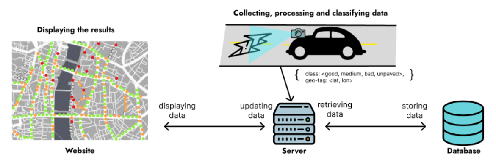

# Road Conditions Monitoring System

Continuous and real-time monitoring of road quality conditions is essential for the maintenance of roads and for ensuring the safety of drivers and their vehicles. 
However, continuous monitoring of thousands of kilometers of roads and highways is a very tedious, time-consuming, error-prone, and an expensive operation.
A deep learning based approach that can automatically classify the road condition can help tremendously in cutting down the time, effort, accuracy, and cost for monitoring and maintenance of vast road infrastructure. 
This project proposes a mechanism to continuously monitor deteriorating road conditions at the city or municipality level in real time and classify them into four different categories (good, medium, bad and unpaved) using deep learning models.

### System Overview

### Screenshots

#### Road Quality Viewing Dashboard

#### Camera Page on Mobile Application that collects road data

